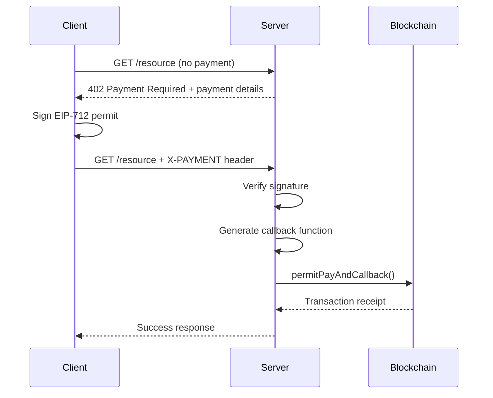

## What is Shit 402?

Shit 402 is an experimental protocol on BSC (Binance Smart Chain) that solves the atomicity problem between payment processing and callback execution. By combining payment settlement and business logic callbacks into a single on-chain transaction, it ensures either complete success or complete failure of both operations.

<Card
  title="Core Innovation"
  icon="atom"
  horizontal
>
  Atomic execution of payment settlement and business callbacks in a single blockchain transaction, eliminating partial failure scenarios.
</Card>

## The Problem

Traditional payment processing flows suffer from critical race conditions and failure modes:

### Standard 402 Implementation Issues

<Tabs>
  <Tab title="Issue 1: Settlement Failure">
    ```javascript
    api.post('/payment', (req, res) => {
      // ... Request processing
      Facilitator.verifyPayment()
      callback() // Transaction success sent
      Facilitator.settlePayment() // ⚠️ May fail due to facilitator limits or timeout
      res.json()
    })
    ```
    **Risk**: User receives success notification but actual settlement fails
  </Tab>

  <Tab title="Issue 2: Concurrency Conflicts">
    ```javascript
    api.post('/payment', (req, res) => {
      // ... Request processing
      Facilitator.verifyPayment()
      Facilitator.settlePayment() // Settlement succeeds
      callback() // ⚠️ Transaction conflicts under high concurrency
      res.json()
    })
    ```
    **Risk**: Payment completes but business logic execution fails
  </Tab>
</Tabs>

### Shit 402 Solution

```javascript
api.post('/v2/payment', (req, res) => {
  // ... Request processing
  Facilitator.verifyPayment()
  const onChainContractAddress = callback() // Process local logic
  Facilitator.settlePayment(onChainContractAddress) // ✅ Atomic execution
  res.json()
})
```

<Columns cols={3}>
  <Card title="Atomicity" icon="lock">
    Payment and callback execute in the same transaction
  </Card>
  <Card title="Consistency" icon="check-circle">
    All-or-nothing execution guarantee
  </Card>
  <Card title="Reliability" icon="shield">
    No need to rely on the server to handle complex on-chain logic
  </Card>
</Columns>

## Technical Architecture

### Core Components

<Columns cols={2}>
  <Card title="Relayer Contract" icon="file-contract">
    Smart contract that handles atomic payment and callback execution using EIP-2612 permit signatures
  </Card>
  <Card title="Payment Server" icon="server">
    Express.js server implementing HTTP 402 payment protocol with EIP-712 signature verification
  </Card>
  <Card title="Client SDK" icon="code">
    TypeScript client for handling payment authorization and signature generation
  </Card>
  <Card title="USD1 Token" icon="coins">
    ERC-20 token with permit functionality (EIP-2612) for gasless approvals
  </Card>
</Columns>

### Payment Flow



## Key Features

### EIP-2612 Permit Integration
Uses permit signatures for gasless token approvals, allowing users to authorize spending without a separate transaction.

### EIP-712 Typed Data Signing
Implements structured data signing for enhanced security and user experience with clear signing prompts.

### HTTP 402 Payment Protocol
Standard HTTP status code implementation for payment-required responses with structured payment instructions.

### Atomic Execution
Single transaction execution ensures payment and callback either both succeed or both fail.

## Smart Contract Interface

The relayer contract provides a single atomic function:

```solidity
function permitPayAndCallback(
    address owner,          // Token owner
    uint256 amount,        // Payment amount
    uint256 permitDeadline, // Permit expiration
    uint8 v,               // Signature component
    bytes32 r,             // Signature component
    bytes32 s,             // Signature component
    address recipient,     // Payment recipient
    address callback       // Callback contract
)
```
## Contract Addresses (BSC)

<Note>
  **Current Deployment:**
  - Relayer Contract: `0x1E160d89dA5F5796e7B939A52f15870a3af358bb`
  - USD1 Token: `0x8d0D000Ee44948FC98c9B98A4FA4921476f08B0d`
</Note>

## Resources

<Card
  title="GitHub Repository"
  icon="github"
  href="https://github.com/Shit402"
>
  Source code and examples
</Card>

<Card
  title="Technical Documentation"
  icon="book"
  href="/technical"
>
  In-depth technical details and implementation guide
</Card>